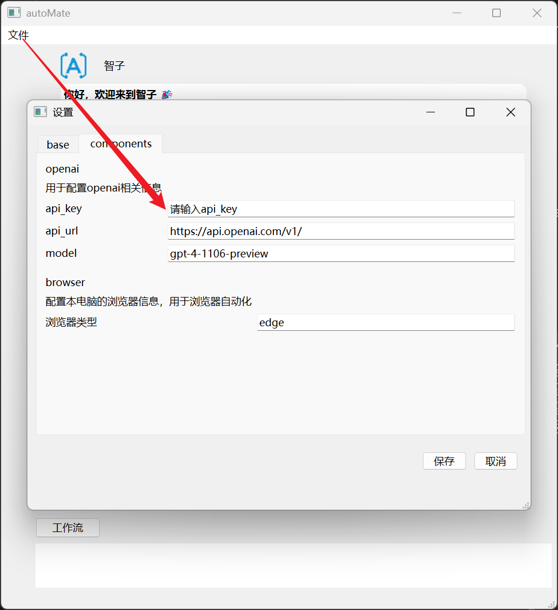
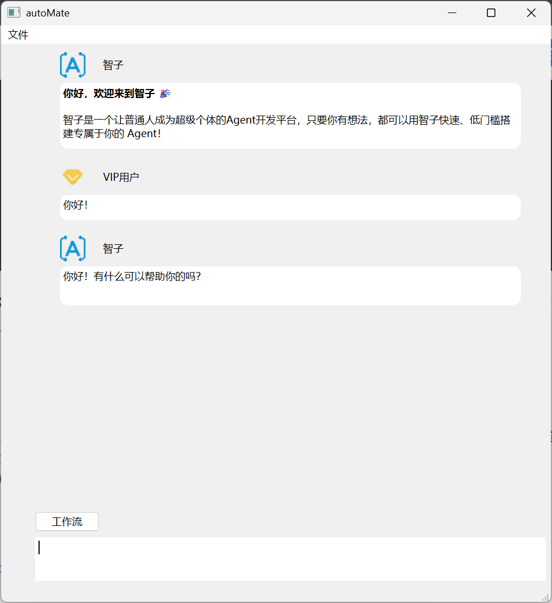
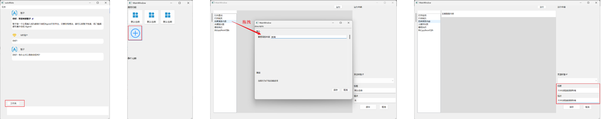

autoMate

<b>autoMate 就像出行中的共享单车，帮你完成软件的最后一个操作，只需 3 分钟就能将 AI 大脑植入任意一个软件。</b>

📚[更全更新的文档地址](https://s0soyusc93k.feishu.cn/wiki/JhhIwAUXJiBHG9kmt3YcXisWnec?from=from_copylink)

各产品优势对比如下。

## 功能介绍

如果你是第一次运行，需要修改配置文件添加 openai 的信息，autoMate 左上角点击文件-->点击components-->配置 openai 相关信息：

### 随时与AI进行沟通

打开界面就能直接与智子进行沟通，任何问题都可以交流。

### 通过拖拽搭建工作流
通过界面拖拽就把让智子完成自动化操作。

- 步骤1：点击工作流；
- 步骤2：在弹出的面板中选择一空白区域，点击创建能力；
- 步骤3：在弹出的编辑器中拖拽组件完成动作流编排；
- 步骤4：填写合适的标题和描述，让智子知道它的作用。

现在智子已经得到了加强！保存后返回到聊天页面，再次输入问题，被加强后的智子就会利用工作流完成定制化任务！

## 感谢以下人员提交的宝贵代码！

