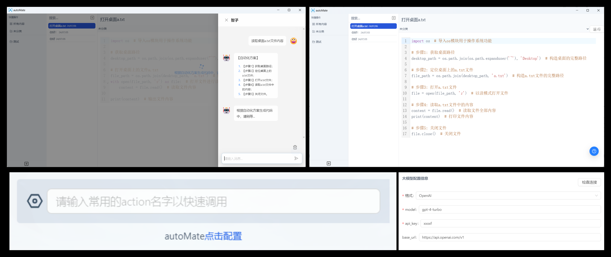

<div align="center"><a name="readme-top"></a>


<h1>autoMate</h1>
<p><b>🤖 AI驱动的本地自动化工具 | 让电脑自己会干活</b></p>

>"让繁琐自动化，把时间还给生活"




</div>

## 💫 重新定义你与电脑的关系

深夜加班处理重复性工作让你疲惫不堪？琐碎任务占用了你的创造力和宝贵时间？

autoMate，不仅仅是一款普通工具，它是AGI第三阶段的智能助手，你的数字同事，始终高效运转，帮你重获工作与生活的平衡。


**让自动化为你的生活创造更多可能。**


## 💡 项目简介
autoMate 是一款革命性的AI+RPA自动化工具，基于OmniParser构建，让AI成为你的"数字员工"，它能够

- 📊 自动操作您的电脑界面，完成复杂的工作流程
- 🔍 智能理解屏幕内容，模拟人类视觉和操作
- 🧠 自主决策，根据任务需求进行判断并采取行动
- 💻 支持本地化部署，保护您的数据安全和隐私

不同于传统RPA工具的繁琐规则设置，autoMate借助大模型的能力，只需用自然语言描述任务，AI就能完成复杂的自动化流程。从此告别重复性工作，专注于真正创造价值的事情！

## 🌟 为什么autoMate会改变你的工作方式

> "在我使用autoMate之前，我每天花费3小时处理报表；现在，我只需10分钟设置任务，然后去做真正重要的事。"一位财务经理的反馈

当你第一次看到autoMate自动完成那些曾经占用你数小时的工作时，你会有一种难以描述的释然。这不仅仅是效率的提升，更是对创造力的解放。

想象一下：每天早上醒来，发现昨晚安排的数据整理、报表生成、邮件回复都已完成，等待你的只有真正需要你智慧和创造力的工作。这就是autoMate带给你的未来。

## ✨ 功能特点

- 🔮 无代码自动化 - 使用自然语言描述任务，无需编程知识
- 🖥️ 全界面操控 - 支持任何可视化界面的操作，不限于特定软件
- 🚅 简化安装 - 比官方版本更简洁的安装流程，支持中文环境，一键部署
- 🔒 本地运行 - 保护数据安全，无需担心隐私泄露
- 🌐 多模型支持 - 兼容主流大型语言模型
- 💎 持续成长 - 随着你的使用，它会越来越了解你的工作习惯和需求

## 🚀 快速开始

### 📦 安装
Clone项目，然后安装环境：

```bash
git clone https://github.com/yuruotong1/autoMate.git
cd autoMate
conda create -n "automate" python==3.12
conda activate automate
pip install -r requirements.txt
```
### 🎮 启动应用

```bash
python main.py
```
然后在浏览器中打开`http://localhost:7888/`，配置您的API密钥和基本设置。


## 📝常见问题

### 🔧CUDA版本不匹配问题
如果启动时报：“显卡驱动不适配，请根据readme安装合适版本的 torch”，说明当前显卡驱动不适配。你可以不用管这条信息，只用CPU运行，但是会非常慢。你也可以：

1. 运行`pip list`查看torch版本；
2. 从[官网](https://pytorch.org/get-started/locally/)查看支持的cuda版本；
3. 重新安装Nvidia驱动。


## 🤝 参与共建

每一个优秀的开源项目都凝聚着集体的智慧。autoMate的成长离不开你的参与和贡献。无论是修复bug、添加功能，还是改进文档，你的每一份付出都将帮助成千上万的人摆脱重复性工作的束缚。

加入我们，一起创造更加智能的未来。

> 强烈推荐阅读 [《提问的智慧》](https://github.com/ryanhanwu/How-To-Ask-Questions-The-Smart-Way)、[《如何向开源社区提问题》](https://github.com/seajs/seajs/issues/545) 和 [《如何有效地报告 Bug》](http://www.chiark.greenend.org.uk/%7Esgtatham/bugs-cn.html)、[《如何向开源项目提交无法解答的问题》](https://zhuanlan.zhihu.com/p/25795393)，更好的问题更容易获得帮助。

<a href="https://github.com/yuruotong1/autoMate/graphs/contributors">
  
</a>

---

<div align="center">
⭐ 每一个Star都是对创作者的鼓励，也是让更多人发现并受益于autoMate的机会 ⭐
今天你的支持，就是我们明天前进的动力
</div>