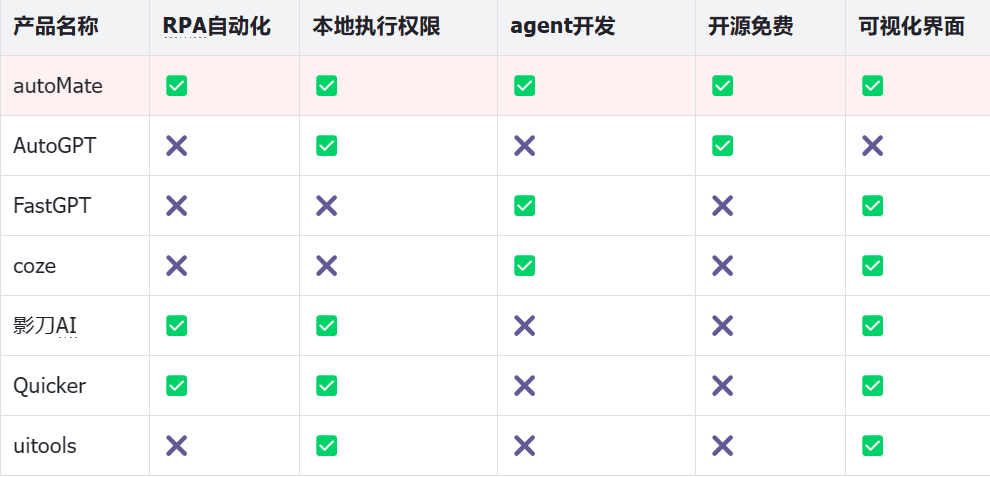

<div align="center">

<a ></a>

<div style="font-size:24px;">autoMate</div>

</div>
<b>autoMate 就像生活出行中的共享单车，帮你完成软件的最后一个操作，只需聊聊天就能将 AI 植入任意一个软件。</b>

<div align="center">


📚[文档地址](https://s0soyusc93k.feishu.cn/wiki/JhhIwAUXJiBHG9kmt3YcXisWnec?from=from_copylink)|🎞️[介绍视频](https://www.bilibili.com/video/BV1LW421R7Ai/?share_source=copy_web&vd_source=c28e503b050f016c21660b69e391d391)

</div>

autoMate 可以生成自动化代码帮助用户减少复性劳动，他做了三件事：

1. 了解、分析用户需求，将需求转换为人人都能看懂的用例；
2. 将用例转换成可执行的代码；
3. 运行代码并调试，解决异常问题。

各产品优势对比如下。




## 为什么做这个项目呢？
好多人找我，他们说影刀、quicker 的拖拽他们看不懂，看似是图形化界面，但其实需要很深的代码功底才能把它写出来，于是我想了一个点子，能不能让用户聊聊天就能把自动化搞出来，不需要拖拽也不需要了解参数(´･_･`)，这些工作全部交给 AI 来做，AI 询问用户的需求，然后再根据用户的需求生成代码，用户可以直接对代码进行修改，不用担心看不懂，因为每一行代码都有友好的提示，而且在代码的旁边有一个小按钮，点击它就能运行，这意味着你无需下载/配置开发环境(¬‿¬)👉 ALL IN ONE，如果运行出错了，别担心，AI 会帮你排查并解决错误。最近 claude 推出了类似的功能，跟 AI 聊聊天就能生成一个贪吃蛇游戏项目，autoMate 和 claude 是否相同呢？不相同，我们只生成自动化代码，只会专注于自动化领域，因此我们的自动化生态会比 claude 更完善，不会生成游戏也不会生成工程项目。微软和苹果相继推出自动化产品 copilot plus 和 apple intelligence，号称能够自动化控制应用，如果他们真能实现， autoMate 还有价值吗？有价值，没有一个产品能满足所有人群的需求，就像 openai 没能统治所有大模型一样，微软和苹果也不可能吃掉所有市场，举一个具体场景，如果他们敢对微信做自动化，腾讯就有十足的把握送他们上法庭，但是我们的产品可以通过插件的方式控制微信。

## autoMate 是如何控制桌面应用的？

不得不说，这是一个世界级的难题。我想到了两个思路，一是封装和调用第三方函数库，二是利用视觉 AI（施工中） 。
第一个思路很简单，大牛们已经封装好了常见的软件操作库，比如使用 python-docx 可以对 word 文档进行读写、使用 Selenium 可以点击浏览器页面中的元素，如果我的操作很复杂没有第三方库怎么办？比如修改 word 中所有表格，每个表格的 2 行 3 列数据精简至 10 字。这其中涉及的操作包括：
1. 打开 word
2.  读取所有表格的 2 行 3 列数据
3. 利用 AI 精简数据
4. 写入表格。

python-docx 能实现步骤 1、2、4，但是步骤 3 怎么实现呢？步骤 3 使用AI精简数据，没有这样的第三方库，这是定制的需求，于是我设想开发一个插件系统，用户只需要按照规则编写插插件并且上传，AI 就能够学会你上传的插件，对于步骤4 来说，我们可以写一个插件去调用大模型接口，让模型返回精简的 100字数据，将这个插件上传到 autoMate 后，智子就能够结合1~4个基础能力，生成可执行的自动化序列。
即便是能够自己封装函数， 也不可能控制所有的软件呀？比如公司内部开发的软件，就没有任何函数库可以去控制，还有一些复杂操作，从网上搜集数据并且进行整理，开发这些插件的时间还不如人工去做！这就提到第二个解决方案：视觉AI算法。用户的自动化需求是打开A软件，点击红色按钮，用户只需要为软件A和红色按键截图然后打上标，于是自动化可以这么去做：

1. 利用 opencv 找到A软件，控制鼠标移动并左键点击；
2. 利用opencv找到红色按钮，并控制鼠标移动并左键点击。

软件这么多，让用户一个一个打标太麻烦了，有更好的思路吗？有！取得用户同意后，autoMate 会拿到用户的打标数据，再把这些数据喂给 yolo，我们训练一个通用视觉模型，他可以识别大部分的场景。然后 yolo 模型结合大语言模型完成自动化用例。


## 功能介绍

### 基础功能

[详见--基础功能](https://s0soyusc93k.feishu.cn/wiki/JhhIwAUXJiBHG9kmt3YcXisWnec#O9W8dEqfBo13oQxCslycFUWonFd)

## 开发指南

本项目分为前端和后端两个部分，前端项目在 app  目录下，后端项目在 server 目录下。这意味着，如果要运行 autoMate，你就得同时启动前端和后端。项目启动后会在～ 目录创建 sqlite 数据库 autoMate.db ，如果想查看数据库内容，建议使用开源数据库软件dbeaver。

### 启动前端

1. 安装 nodejs，使用最新版本即可；
2. 使用命令行进入到 app 目录；
3. 输入 npm install 安装依赖；
4. 输入 npm run dev 启动前端。

### 启动后端：

1. 安装python3，最好 3.9+版本。
2. 使用命令行进入 server 目录；
3. 创建并激活虚拟环境，输入 python -m venv .venv；
4. 输入 pip install -r requirements.txt 安装依赖；
5. 输入 flask --app main run 启动后端

### 打包

后端打包命令：

`pyinstaller main.spec`

前端打包命令：

# win可以换成mac

`npm run build:win`

打包完成后，将main.exe放在前端根目录下。

### 开发小技巧

如果你想用console.log打印内容并且查看，需要打开devtools才能够查看到，可以在/app/src/main/windows.ts中将openDevTools工具设置为true。每一个界面都有单独的devtools。根据自己调试需要打开相应的开关即可。

```js
export const config = {
    search: {
        id: 0,
        options: {
            initShow: true,
            hash: '',
            openDevTools: false,
        }
    },
    code: {
        id: 0,
        options: {
            initShow: true,
            width: 1300,
            height: 700,
            openDevTools: false,
            frame: true,
            transparent: false,
            hash: '/#config/category/contentList'
        }
    },
    config: {
        id: 0,
        options: {
            initShow: true,
            width: 600,
            height: 400,
            openDevTools: false,
            frame: true,
            transparent: false,
            hash: '/#config'
        }
    }

} as Record<WindowNameType, {id: number,  options: OptionsType }>
```

## 感谢以下贡献者


<a href="https://github.com/yuruotong1/autoMate/graphs/contributors">
  
</a>